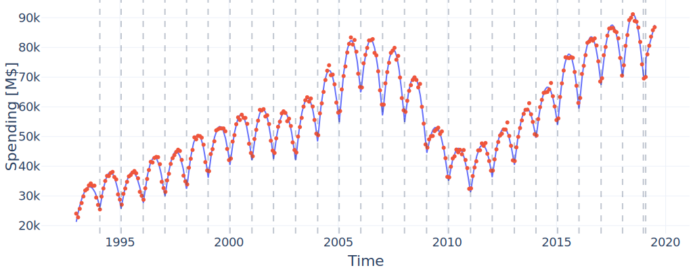
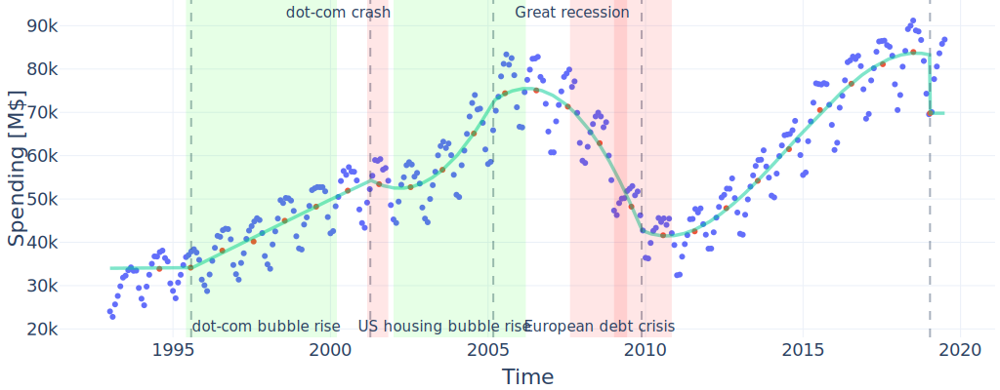

# pcw-regrs
Fast, optimal, extensible and cross-validated heterogeneous piecewise polynomial regression for timeseries.

The algorithm is implemented in Rust in the `pcw_regrs` subdirectory. A Python API can be found in `pcw_regrs_py` and installed via `maturin`.

# Real world example

Here we've fitted a piecwise polynomial model to the `construction` dataset of the [Turing Change Point Dataset](https://github.com/alan-turing-institute/TCPD) in a two-step procedure. The first fit determines local behaviour (our model in green):



We calculated means based on the resulting piecewise polynomial model and used these to fit another model to capture global trends:



The determined changepoints (dashed lines) can be seen to coincide reasonably to economically significant events (shaded regions).

# How to use

Please check out the [example notebook](example.ipynb) for a quick-start on how to use the Python-API.

# General structure

![A basic pipeline diagram for the algorithm. The input consists of a timeseries sample as well as the optional parameters. These are sent into a preprocessing stage for validation and to optionally calculate the training errors. Once that's finished we move on to the main algorithm which solves the main dynamic program, determines the CV and model functions and then determines the CV- or OSE-optimal piecewise functions. Finally a postprocessing stage is used to select cut representatives either by calculating segment middlepoints or running a continuity optimization](./img/arch.svg)

# Optional features

Note that the crate comes with a variety of optional features:

* `serde` - (de-)serialization support
* `nightly-only` - enable nightly-only features of the dependencies
* `parallel_rayon` - compute residual errors in parallel (highly recommended for anything but the smallest timeseries)
* `dofs-sub-one` - this is a rather technical feature. By default we allow up to `n` degrees of freedom for a segment of length `n`. From the theoretical side this leads to problems (because single points may in some sense lose their influence on the surrounding timeseries). This feature replaces this bound by `n` by one which instead bounds by `n-1` effectively forcing regression over interpolation; importantly it removes possibility of the model to jump to single outlier datapoints with a constant segment etc. While this can lead to different models in some instances, on most real datasets you probably won't notice a difference because the segment dofs will already be restrained by local / global bounds and small interpolating models usually won't get selected.

# Building

> [!NOTE]
> Note that building currently (at the time of writing: September 2023) requires a nightly rust compiler which may be easily installed using `rustup toolchain install nightly`. We're only using it for [`let-chains`](https://github.com/rust-lang/rust/issues/53667); these could be removed relatively easily if a stable variant is needed, at the expense of making the code a bit more verbose. See also the [`https://crates.io/crates/if_chain`](if_chain) crate in this regard.

## Rust

The pure Rust part is a regular `cargo` project and can be managed accordingly. Note also that `pcw-regrs` has been published to [crates.io](https://crates.io/).

## Python

> [!IMPORTANT]
> Usually building from source is not necessary and you can simply install `pcw-regrs-py` via `pip`.

To build the python package install [maturin](https://www.maturin.rs/) for example via `pip` by running

```bash
pip install maturin
````

Running

```bash
maturin develop --release
```

from the [python subfolder](pcw_regrs_py) will compile an release (=optimized) build, build a python wheel and install it locally. For more details like how to cross compile please consult the maturin documentation.
